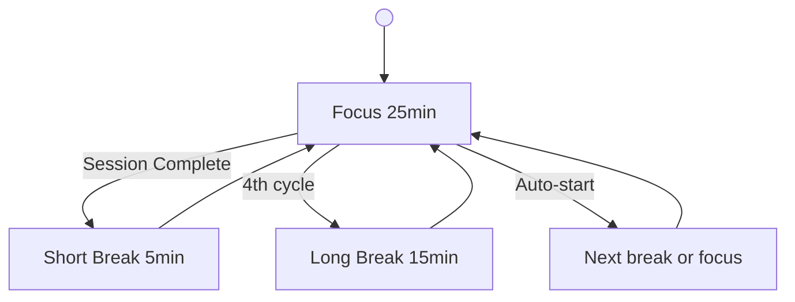

<div align="center">

# 🍅 Pomodoro Timer

[](https://soumendrak.github.io/pomodoro/)
[](LICENSE)
[](https://developer.mozilla.org/en-US/docs/Web/HTML)
[](index.html)

<svg xmlns="http://www.w3.org/2000/svg" width="120" height="120" viewBox="0 0 120 120">
  <circle cx="60" cy="60" r="52" fill="none" stroke="#2a2a2e" stroke-width="6"/>
  <circle cx="60" cy="60" r="52" fill="none" stroke="#f97316" stroke-width="6" stroke-dasharray="0 327" stroke-linecap="round" transform="rotate(-90,60,60)"/>
  <circle cx="60" cy="27" r="5" fill="#f97316"/>
  <line x1="60" y1="60" x2="60" y2="32" stroke="#f97316" stroke-width="3" stroke-linecap="round"/>
  <line x1="60" y1="60" x2="82" y2="50" stroke="#f97316" stroke-width="2.5" stroke-linecap="round"/>
  <circle cx="60" cy="60" r="8" fill="#f97316"/>
</svg>

A **minimal, polished Pomodoro timer** — built as a single HTML file with zero dependencies. Deployable instantly on GitHub Pages or any static host.

**Live → [soumendrak.github.io/pomodoro](https://soumendrak.github.io/pomodoro/)**

</div>

---

## Features

- ⏱ **Focus / Short Break / Long Break** modes (25 min / 5 min / 15 min)
- 🎨 **Dark theme** with orange accent, smooth animations, and SVG ring countdown
- ▶️ **Start, Pause, Reset** — plus keyboard shortcuts (`Space` to toggle, `R` to reset)
- 🔄 **Auto-cycling** through the classic Pomodoro sequence
- 🔔 **Audio beep** at session end (Web Audio API oscillator — no external files)
- 📊 **Session counter** — pomodoros this cycle and lifetime total
- 📱 **Fully responsive** — works on mobile and desktop
- 🧹 **Zero dependencies** — no frameworks, no CDN links, no build step
- 🚀 **Ready for GitHub Pages** — just push and enable

## How It Works



The timer follows the classic Pomodoro Technique:

1. Work for **25 minutes** (Focus)
2. Take a **5 minute** short break
3. Repeat 3 more times
4. After the 4th focus session, take a **15 minute** long break
5. Repeat the cycle

Sessions auto-advance with an audible beep and optional desktop notification.

## Getting Started

### Local

Just open `index.html` in any modern browser:

```bash
open index.html
```

### GitHub Pages

1. Fork or copy this repository
2. Push to `https://github.com/soumendrak/pomodoro`
3. In the repo Settings → Pages, select `main` branch and `/ (root)` folder
4. Visit `https://soumendrak.github.io/pomodoro/`

## Keyboard Shortcuts

| Key | Action |
|-----|--------|
| `Space` | Start / Pause |
| `R` | Reset |

## License

```
MIT License

Copyright (c) 2025 Soumendra Kumar Sahoo

Permission is hereby granted, free of charge, to any person obtaining a copy
of this software and associated documentation files (the "Software"), to deal
in the Software without restriction, including without limitation the rights
to use, copy, modify, merge, publish, distribute, sublicense, and/or sell
copies of the Software, and to permit persons to whom the Software is
furnished to do so, subject to the following conditions:

The above copyright notice and this permission notice shall be included in all
copies or substantial portions of the Software.

THE SOFTWARE IS PROVIDED "AS IS", WITHOUT WARRANTY OF ANY KIND, EXPRESS OR
IMPLIED, INCLUDING BUT NOT LIMITED TO THE WARRANTIES OF MERCHANTABILITY,
FITNESS FOR A PARTICULAR PURPOSE AND NONINFRINGEMENT. IN NO EVENT SHALL THE
AUTHORS OR COPYRIGHT HOLDERS BE LIABLE FOR ANY CLAIM, DAMAGES OR OTHER
LIABILITY, WHETHER IN AN ACTION OF CONTRACT, TORT OR OTHERWISE, ARISING FROM,
OUT OF OR IN CONNECTION WITH THE SOFTWARE OR THE USE OR OTHER DEALINGS IN THE
SOFTWARE.
```
